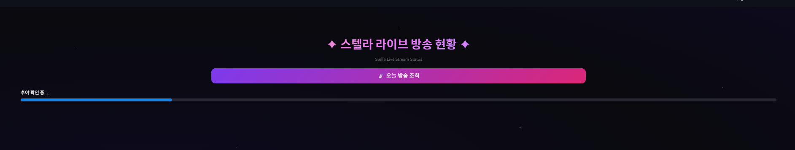
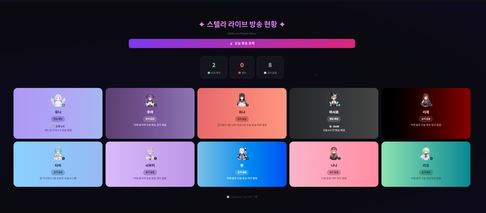

# ⭐ Stella Live Tracker

스텔라라이브 멤버 방송/휴방 현황을 자동으로 조회하는 대시보드


## 주요 기능

- 네이버 카페 공지글 자동 크롤링
- Claude AI로 방송/휴방 여부 및 사유 분석
- 멤버별 테마 컬러 카드 UI
- 오늘 날짜 기준 스마트 필터링

## 실행 화면

### 조회 중



### 결과



## 실행 방법

1. `.env` 파일 생성 후 쿠키값 입력
2. 패키지 설치

```bash
   pip install -r requirements.txt
```

3. 실행

```bash
   streamlit run app.py
```

## 환경변수 (.env)

```
NAVER_NID_AUT=
NAVER_NID_SES=
NAVER_JSESSIONID=
ANTHROPIC_API_KEY=
```

## 기술 스택

- Python
- Streamlit
- Claude API (claude-haiku)
- Naver Cafe API
